# Práctica 3: Redes Virtuales y Aislamiento en Google Cloud Platform

**Asignatura:** Computación en la Nube  
**Institución:** Universidad Francisco de Paula Santander (UFPS)  

| Parámetro | Valor |
| :--- | :--- |
| **Integrantes del Equipo** | Beymar Villamizar - 1152426<br/>Luisangel Ferizzola Roa - 1152409<br/>Angel Johany Vesga Sarmiento - 1152381 |
| **ID del Proyecto** | `project-3111890e-6ba4-4e0e-95f` |
| **Número de Proyecto** | `421977311923` |
| **Prefijo de Recursos** | `villamizar` |
| **Región** | `us-central1` |
| **Zona** | `us-central1-a` |

---

## Diagrama de la infraestructura

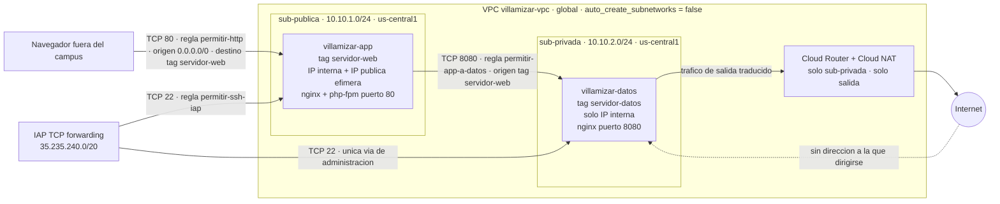

El tráfico público entra desde Internet a través del puerto TCP 80 directo a la máquina de aplicación `villamizar-app` gracias a su IP pública efímera y la regla de cortafuegos filtrada por la etiqueta de red `servidor-web`. El tráfico de salida de la máquina privada `villamizar-datos` fluye exclusivamente hacia Internet mediante el servicio gestionado Cloud NAT asociado a la subred privada, permitiendo actualizar paquetes o consultar servicios externos sin exponer ninguna dirección IP pública hacia el exterior.

---

## Evidencias de Ejecución

### Evidencia 0 — Preparación

Se configuró el entorno inicial en Google Cloud Shell instalando el binario de Terraform v1.16.2 y validando la autenticación del usuario y la selección del proyecto activo en Google Cloud Platform mediante `gcloud config list`.

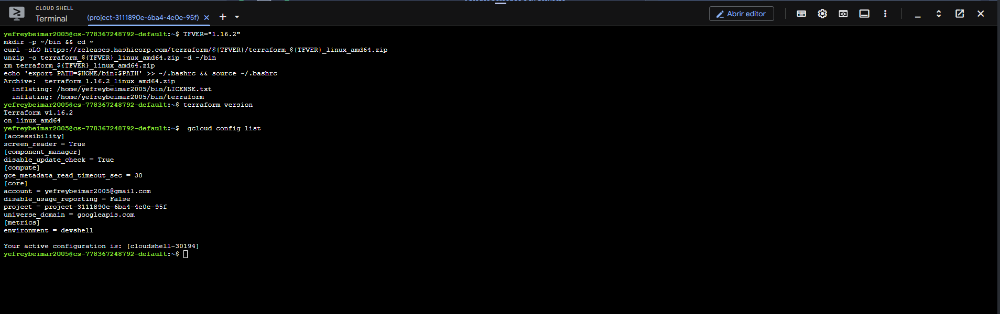
Demostración del entorno de trabajo en Google Cloud Shell con Terraform instalado y la configuración activa de la cuenta y el proyecto en GCP.

```text
yefreybeimar2005@cs-778367248792-default:~$ terraform version
Terraform v1.16.2
on linux_amd64

yefreybeimar2005@cs-778367248792-default:~$ gcloud config list
[core]
account = yefreybeimar2005@gmail.com
disable_usage_reporting = False
project = project-3111890e-6ba4-4e0e-95f
```

---

### Evidencia 1 — La red y su subred

Aprovisionamiento de la Virtual Private Cloud en modo personalizado (`auto_create_subnetworks = false`) denominada `villamizar-vpc` y la subred pública inicial `villamizar-sub-publica` con el rango CIDR `10.10.1.0/24` en la región `us-central1`.

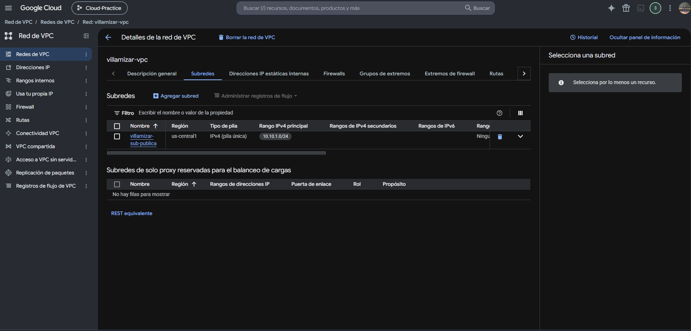
Detalle en la consola de Google Cloud de la VPC personalizada `villamizar-vpc` y la subred pública `villamizar-sub-publica` desplegada en la región `us-central1` con el bloque `10.10.1.0/24`.

```text
Plan: 2 to add, 0 to change, 0 to destroy.

google_compute_network.vpc: Creating...
google_compute_network.vpc: Creation complete after 22s [id=projects/project-3111890e-6ba4-4e0e-95f/global/networks/villamizar-vpc]
google_compute_subnetwork.publica: Creating...
google_compute_subnetwork.publica: Creation complete after 11s [id=projects/project-3111890e-6ba4-4e0e-95f/regions/us-central1/subnetworks/villamizar-sub-publica]

Apply complete! Resources: 2 added, 0 changed, 0 destroyed.
```

---

### Evidencia 2 — Variables y salidas

Parametrización del código declarativo mediante `variables.tf` y `terraform.tfvars`, junto con la definición de salidas en `outputs.tf`. La ejecución de `terraform plan` y `terraform apply` refleja la incorporación de outputs sin alterar los recursos previamente creados.

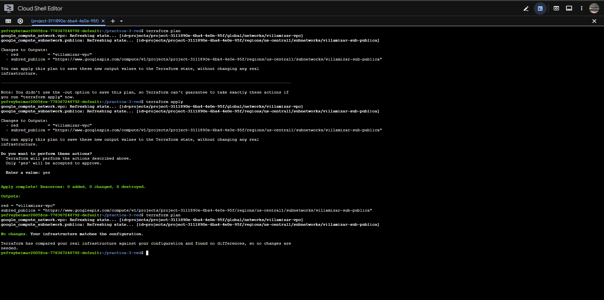
Ejecución de `terraform plan` y `terraform apply` tras parametrizar la infraestructura con variables y definir los outputs sin alterar los recursos ya aprovisionados.

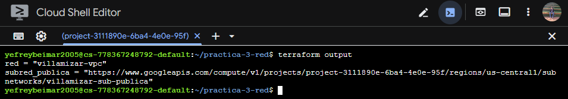
Salida del comando `terraform output` mostrando los valores calculados para el nombre de la VPC y el self-link de la subred pública.

```text
yefreybeimar2005@cloudshell:~/practica-3-red (project-3111890e-6ba4-4e0e-95f)$ terraform plan
google_compute_network.vpc: Refreshing state... [id=projects/project-3111890e-6ba4-4e0e-95f/global/networks/villamizar-vpc]
google_compute_subnetwork.publica: Refreshing state... [id=projects/project-3111890e-6ba4-4e0e-95f/regions/us-central1/subnetworks/villamizar-sub-publica]

No changes. Your infrastructure matches the configuration.

yefreybeimar2005@cloudshell:~/practica-3-red (project-3111890e-6ba4-4e0e-95f)$ terraform output
red = "villamizar-vpc"
subred_publica = "https://www.googleapis.com/compute/v1/projects/project-3111890e-6ba4-4e0e-95f/regions/us-central1/subnetworks/villamizar-sub-publica"
```

---

### Evidencia 3 — La aplicación

Despliegue de la máquina virtual `villamizar-app` (tipo `e2-micro`, imagen Debian 12) ubicada en la subred pública con dirección IP interna `10.10.1.2`, etiqueta de red `servidor-web` y script de arranque para aprovisionar el servidor web.

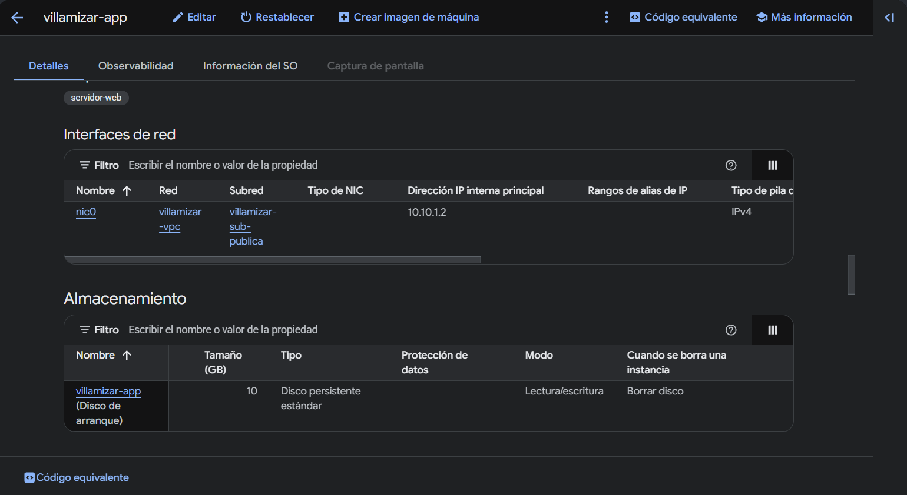
Detalle de la instancia `villamizar-app` en Google Cloud Console, verificando su ubicación en la subred pública con IP interna `10.10.1.2` y la etiqueta de red `servidor-web`.

---

### Evidencia 4 — Las puertas

Configuración de las reglas de cortafuegos para permitir el tráfico HTTP público (puerto 80) a las instancias con la etiqueta `servidor-web` y el acceso SSH (puerto 22) exclusivamente a través del rango de Google Identity-Aware Proxy (`35.235.240.0/20`).

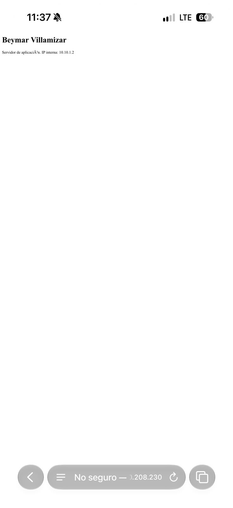
Acceso HTTP exitoso desde un navegador web externo a través de la IP pública efímera de la máquina de aplicación.

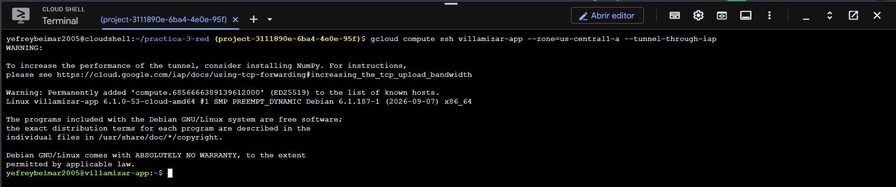
Conexión administrativa segura por SSH a la instancia `villamizar-app` canalizada a través del túnel IAP (`--tunnel-through-iap`).

```text
yefreybeimar2005@cloudshell:~/practica-3-red (project-3111890e-6ba4-4e0e-95f)$ gcloud compute firewall-rules list --filter="network=villamizar-vpc" \
  --format="table(name,sourceRanges.list(),sourceTags.list(),targetTags.list(),allowed[].map().firewall_rule().list())"
NAME: villamizar-permitir-app-a-datos
SOURCE_RANGES: 
SOURCE_TAGS: servidor-web
TARGET_TAGS: servidor-datos
ALLOW: tcp:8080

NAME: villamizar-permitir-http
SOURCE_RANGES: 0.0.0.0/0
SOURCE_TAGS: 
TARGET_TAGS: servidor-web
ALLOW: tcp:80

NAME: villamizar-permitir-ssh-iap
SOURCE_RANGES: 35.235.240.0/20
SOURCE_TAGS: 
TARGET_TAGS: servidor-web,servidor-datos
ALLOW: tcp:22
```

---

### Evidencia 5 — Reproducir desde cero

Verificación de la reproducibilidad de la infraestructura como código mediante la destrucción total de los recursos con `terraform destroy` y su posterior reconstrucción limpia con `terraform apply`, demostrando la asignación de una nueva dirección IP pública efímera y la correcta inicialización del servicio.

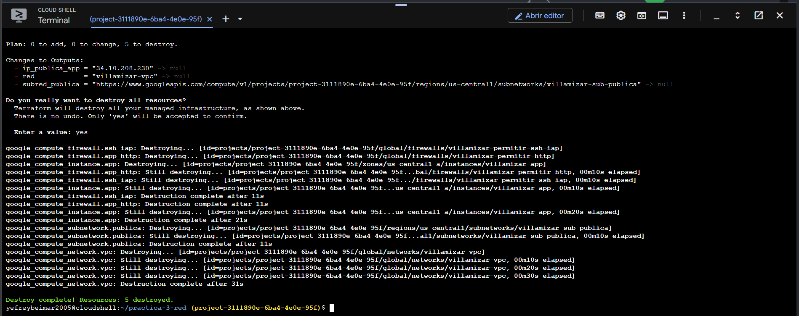
Destrucción completa de los recursos gestionados (`Destroy complete! Resources: 5 destroyed.`) antes de proceder a la reconstrucción integral del entorno.

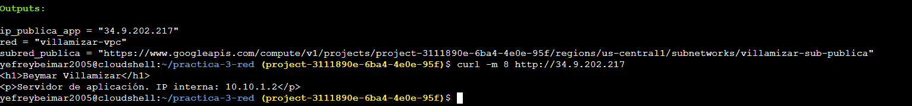
Recreación de la infraestructura con `terraform apply`, asignación de una nueva IP pública efímera (`34.9.202.217`) y comprobación exitosa del servicio mediante `curl`.

```text
Outputs:

ip_publica_app = "34.9.202.217"
red = "villamizar-vpc"
subred_publica = "https://www.googleapis.com/compute/v1/projects/project-3111890e-6ba4-4e0e-95f/regions/us-central1/subnetworks/villamizar-sub-publica"

yefreybeimar2005@cloudshell:~/practica-3-red (project-3111890e-6ba4-4e0e-95f)$ curl -m 8 http://34.9.202.217
<h1>Beymar Villamizar</h1>
<p>Servidor de aplicación. IP interna: 10.10.1.2</p>
```

```bash
terraform destroy
gcloud compute instances list
gcloud compute networks list
terraform apply
```

---

### Evidencia 6 — La máquina que nadie puede alcanzar

#### (a) Página de la aplicación mostrando el dato que vino de la máquina privada

La aplicación PHP ejecutada en `villamizar-app` consulta internamente a la máquina de datos `villamizar-datos` (`http://10.10.2.2:8080/`) y presenta la información obtenida en la respuesta HTTP pública.

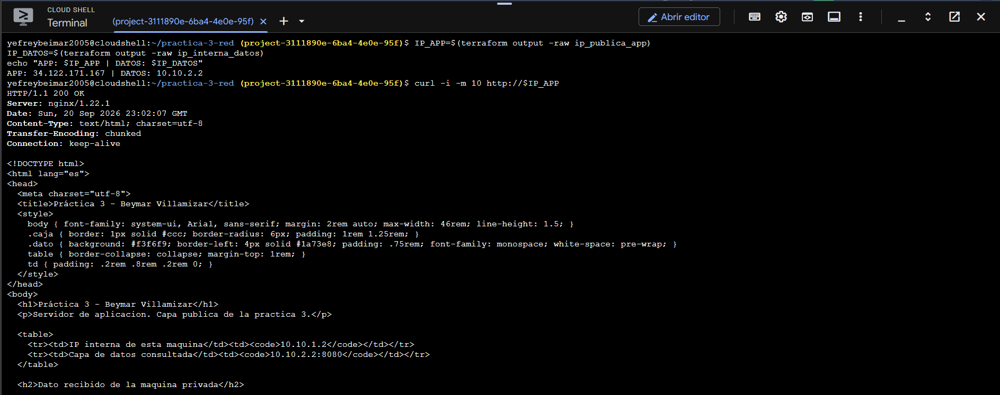
Petición HTTP a la IP pública de la aplicación (`villamizar-app`) consumiendo y renderizando dinámicamente la información JSON suministrada por la capa privada de datos.

```text
yefreybeimar2005@cloudshell:~/practica-3-red (project-3111890e-6ba4-4e0e-95f)$ curl -i -m 10 http://34.122.171.167
HTTP/1.1 200 OK
Server: nginx/1.22.1
Content-Type: text/html; charset=utf-8

<!DOCTYPE html>
<html lang="es">
<head>
  <meta charset="utf-8">
  <title>Práctica 3 - Beymar Villamizar</title>
...
  <h1>Práctica 3 - Beymar Villamizar</h1>
  <p>Servidor de aplicacion. Capa publica de la practica 3.</p>
  <table>
    <tr><td>IP interna de esta maquina</td><td><code>10.10.1.2</code></td></tr>
    <tr><td>Capa de datos consultada</td><td><code>10.10.2.2:8080</code></td></tr>
  </table>
```

#### (b) Intento externo que no responde

Intento de conexión directa desde fuera de la VPC hacia la máquina de datos privada (`http://10.10.2.2:8080/`). Al carecer de IP pública y no estar expuesta, la petición agota el tiempo de espera (código de salida 28).

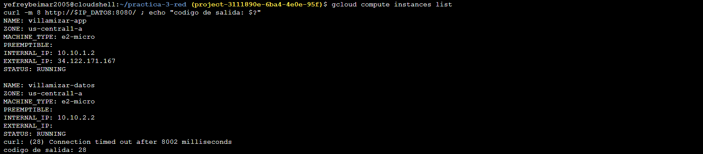
Demostración de aislamiento perimetral: el intento de conexión directa desde el exterior hacia la IP interna privada (`10.10.2.2:8080`) resulta en agotamiento de tiempo de espera (timeout, código 28).

```text
yefreybeimar2005@cloudshell:~/practica-3-red (project-3111890e-6ba4-4e0e-95f)$ gcloud compute instances list
NAME: villamizar-app    ZONE: us-central1-a  INTERNAL_IP: 10.10.1.2  EXTERNAL_IP: 34.122.171.167  STATUS: RUNNING
NAME: villamizar-datos  ZONE: us-central1-a  INTERNAL_IP: 10.10.2.2  EXTERNAL_IP:                 STATUS: RUNNING

yefreybeimar2005@cloudshell:~/practica-3-red (project-3111890e-6ba4-4e0e-95f)$ curl -m 8 http://10.10.2.2:8080/ ; echo "codigo de salida: $?"
curl: (28) Connection timed out after 8002 milliseconds
codigo de salida: 28
```

#### (c) Consulta interna que sí responde

Consulta directa desde la máquina `villamizar-app` hacia la máquina privada `villamizar-datos` en `10.10.2.2:8080` ejecutada a través de SSH IAP. La comunicación interna autorizada por la regla `permitir-app-a-datos` responde satisfactoriamente con el JSON generado.

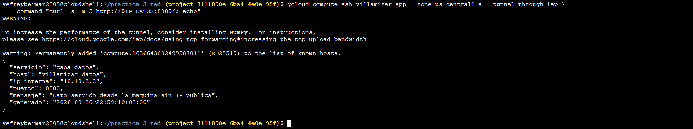
Consulta interna autorizada mediante SSH IAP desde la máquina web hacia la instancia de datos privada (`http://10.10.2.2:8080/`), obteniendo la respuesta JSON correcta.

```text
yefreybeimar2005@cloudshell:~/practica-3-red (project-3111890e-6ba4-4e0e-95f)$ gcloud compute ssh villamizar-app --zone us-central1-a --tunnel-through-iap \
  --command "curl -s -m 5 http://10.10.2.2:8080/; echo"
{
  "servicio": "capa-datos",
  "host": "villamizar-datos",
  "ip_interna": "10.10.2.2",
  "puerto": 8080,
  "mensaje": "Dato servido desde la maquina sin IP publica",
  "generado": "2026-09-20T22:59:10+00:00"
}
```

#### (d) Salida a Internet por Cloud NAT de la máquina privada

Comprobación de conectividad de salida a Internet para la máquina privada sin IP pública a través del Cloud NAT, comparando la IP pública de salida NAT con la IP pública de la máquina de aplicación:

```text
yefreybeimar2005@cloudshell:~/practica-3-red (project-3111890e-6ba4-4e0e-95f)$ gcloud compute ssh villamizar-datos --zone us-central1-a --tunnel-through-iap \
  --command "curl -s -m 10 https://ifconfig.me; echo"
34.66.3.147

yefreybeimar2005@cloudshell:~/practica-3-red (project-3111890e-6ba4-4e0e-95f)$ echo "IP publica de la app: $IP_APP"
IP publica de la app: 34.122.171.167
```

---

## Comandos Ejecutados

```bash
# Preparación
TFVER="1.9.5"
mkdir -p ~/bin && cd ~
curl -sLO https://releases.hashicorp.com/terraform/${TFVER}/terraform_${TFVER}_linux_amd64.zip
unzip -o terraform_${TFVER}_linux_amd64.zip -d ~/bin
echo 'export PATH=$HOME/bin:$PATH' >> ~/.bashrc && source ~/.bashrc
terraform version
gcloud config list
gcloud services enable compute.googleapis.com iap.googleapis.com
git clone https://github.com/Beymarjefreyve/practica-3-red.git && cd practica-3-red

# Fases 1 a 5
terraform init
terraform plan
terraform apply
terraform output
gcloud compute ssh villamizar-app --zone us-central1-a --tunnel-through-iap
terraform destroy
gcloud compute instances list
gcloud compute networks list
terraform apply

# Fase 6
git pull && terraform init && terraform plan && terraform apply
IP_APP=$(terraform output -raw ip_publica_app)
IP_DATOS=$(terraform output -raw ip_interna_datos)

# Evidencia 6a — la pagina con el dato de la maquina privada
curl -i -m 10 http://$IP_APP

# Evidencia 6b — el intento externo
gcloud compute instances list
curl -m 8 http://$IP_DATOS:8080/ ; echo "codigo de salida: $?"

# Evidencia 6c — la consulta interna
gcloud compute ssh villamizar-app --zone us-central1-a --tunnel-through-iap \
  --command "curl -s -m 5 http://$IP_DATOS:8080/; echo"

# La salida por NAT de la maquina sin IP publica
gcloud compute ssh villamizar-datos --zone us-central1-a --tunnel-through-iap \
  --command "curl -s -m 10 https://ifconfig.me; echo"

# Al terminar, porque el NAT factura por existir
terraform destroy
```

---

## Decisiones Libres de Diseño

| Decisión | Justificación |
| :--- | :--- |
| **Servicio desplegado en la máquina de datos** | Se implementó un servidor Nginx configurado para servir un documento JSON en el puerto 8080. Esta solución constituye el servicio más liviano y libre de dependencias para comprobar la comunicación entre capas sin requerir gestión de usuarios ni credenciales de base de datos. Además, utilizar un puerto no estándar como el 8080 obliga a definir una regla de cortafuegos interna explícitamente separada de la regla pública del puerto 80. En una arquitectura de producción con un motor como PostgreSQL en el puerto 5432, el esquema de aislamiento perimetral sería idéntico, variando únicamente el puerto objetivo y el protocolo de consulta. |
| **Organización modular de archivos Terraform** | La infraestructura se estructuró en un archivo central `main.tf`, complementado por `variables.tf` para valores parametrizables entre entornos y `outputs.tf` para exponer los datos relevantes de la red. Este criterio responde al ciclo de vida funcional de cada archivo en lugar de fragmentar arbitrariamente por tipo de recurso. Dividir la topología en múltiples archivos por componentes habría dificultado la trazabilidad de las dependencias implícitas entre subredes, cortafuegos e instancias. |
| **Administración de instancias privadas** | La administración de la máquina de datos sin IP pública se realiza exclusivamente mediante IAP TCP forwarding. La regla de cortafuegos para el puerto 22 restringe el origen al bloque oficial `35.235.240.0/20` y se aplica directamente sobre la etiqueta `servidor-datos`. Esto habilita el acceso mediante `gcloud compute ssh --tunnel-through-iap` validando la identidad del operador mediante IAM y registrando auditoría en Cloud Logging, sin exponer puertos a Internet ni requerir un servidor bastión adicional que incrementaría los costos y la superficie de ataque. |
| **Segmentación del espacio de direccionamiento** | Se asignaron los direccionamientos contiguos `10.10.1.0/24` y `10.10.2.0/24` pertenecientes al bloque maestro `10.10.0.0/16` reservado para el proyecto. Esta organización permite que ante una eventual interconexión mediante Cloud VPN o VPC Peering con otras redes, toda la infraestructura se resuma en un único prefijo de enrutamiento limpio. Asimismo, se evitaron rangos comunes como `10.0.0.0/24` o `192.168.1.0/24` para prevenir conflictos de solapamiento IP, garantizando más de 250 direcciones útiles por subred. |

---

## Preguntas de Reflexión

### Quitar la etiqueta de red a la máquina de aplicación
Si se remueve la etiqueta `servidor-web` de la instancia `villamizar-app`, esta pierde inmediatamente la vinculación con las reglas de cortafuegos `permitir-http` y `permitir-ssh-iap` (donde actuaba como destino), y deja de ser un origen reconocido para la regla `permitir-app-a-datos`. En consecuencia, la aplicación deja de responder peticiones desde Internet y las sesiones administrativas SSH mediante túnel IAP no logran conectar, a pesar de que la máquina virtual y los servicios Nginx/PHP continúen en ejecución activa y respondan localmente ante `curl localhost`. La regla de firewall no desaparece porque constituye un objeto global de la VPC independiente de las instancias, diseñado para aplicar sus políticas a cualquier máquina presente o futura que porte dicha etiqueta. El síntoma observado por un cliente externo es un agotamiento de tiempo de espera (timeout) y no un rechazo explícito de conexión, ya que los paquetes entrantes no autorizados son descartados silenciosamente por el cortafuegos de Google Cloud.

### Por qué el plan de la fase 2 no propuso cambios
Terraform opera mediante la comparación entre el estado deseado (definido en el código `.tf`) y el estado real de los recursos registrado en el archivo `terraform.tfstate`. En la fase 2, el reemplazo de valores literales por variables con valores equivalentes no produjo ninguna diferencia en los atributos reales de la infraestructura en GCP, y la adición de bloques `output` se limita a tareas de lectura e inspección de atributos ya existentes. Para provocar una recreación o reemplazo destructivo en el plan, sería necesario modificar un atributo inmutable que el proveedor no puede actualizar en caliente, como cambiar el rango `ip_cidr_range` de una subred existente, alterar la región geográfica o renombrar el recurso en la nube; en tales casos, Terraform marcaría la acción como `forces replacement` debido a restricciones del API de Compute Engine.

### Estimación mensual de costos de infraestructura

| Recurso | Cómo factura | Costo mensual estimado (USD) |
| :--- | :--- | :--- |
| **2 Instancias e2-micro** | Cómputo por segundo (~$0.0084/hora c/u, 730 horas al mes) | ~$12.26 |
| **2 Discos persistentes estándar (10 GB c/u)** | Almacenamiento aprovisionado ($0.04/GB al mes por 20 GB) | ~$0.80 |
| **IP pública efímera** | Costo por hora en uso asociada a la VM pública ($0.005/hora) | ~$3.65 |
| **VPC, Subredes y Reglas de Cortafuegos** | Objetos lógicos de red en GCP | $0.00 |
| **Cloud NAT y Cloud Router** | Tarifa base fija del gateway ($0.045/hora) más procesamiento | ~$32.85 |
| **Tráfico de salida a Internet (Egress)** | Transferencia de datos salientes (primer GB gratis) | ~$0.05 |
| **Total Mensual Estimado** | | **~$49.61 USD** |

> [!NOTE]
> Estimación calculada con base en los precios estándar de Google Cloud Platform para la región `us-central1` operando 730 horas continuas al mes.

El recurso que resulta más sorprendente en la estructura de costos es **Cloud NAT**. A diferencia de las instancias de cómputo cuyo consumo cesa al apagarlas, la pasarela de Cloud NAT factura una tarifa base fija continua por hora simplemente por existir, con independencia de si cursa tráfico o si las máquinas asociadas están detenidas. En escenarios con cargas de trabajo mínimas o de prueba, el costo de disponibilidad de Cloud NAT puede superar ampliamente el costo mensual de las propias instancias `e2-micro`.
 
---
 
## El estado no va al repositorio
 
El archivo de estado de Terraform contiene información sensible sobre la infraestructura aprovisionada (identificadores, configuraciones de red y metadatos) que no debe almacenarse en el control de versiones público. Desde el commit inicial del proyecto, el archivo `.gitignore` incluye las directivas necesarias para excluir el directorio local `.terraform/` y los ficheros `*.tfstate*`:
 
```gitignore
# .gitignore
.terraform/
*.tfstate
*.tfstate.*
crash.log
```
 
Para verificar que ningún archivo de estado o binario del proveedor haya sido indexado por Git, se ejecutó la comprobación sobre el árbol de trabajo rastreado:
 
```bash
git ls-files | grep -E "tfstate|\.terraform"
```
 
**Salida obtenida:**
```text
(salida vacía)
```
 
La ausencia total de resultados confirma que la configuración de exclusión se cumple estrictamente y que el estado de Terraform se mantiene aislado en el entorno local de trabajo.